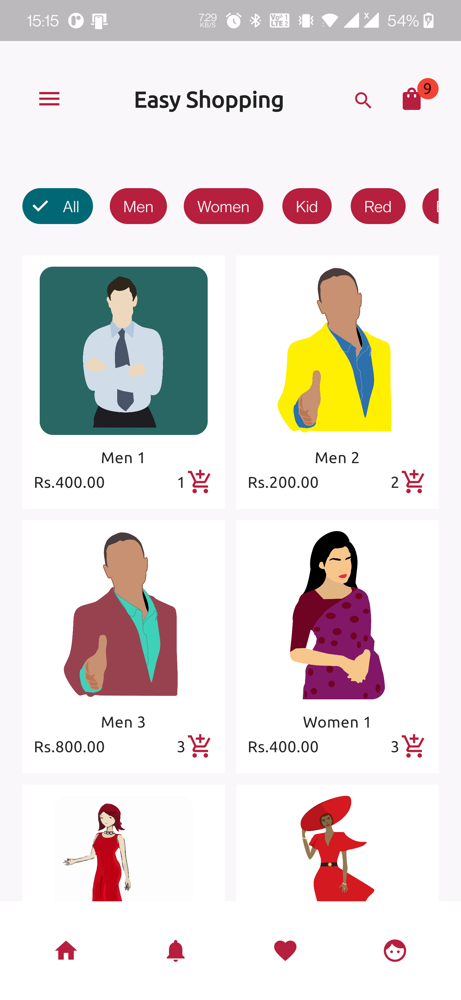
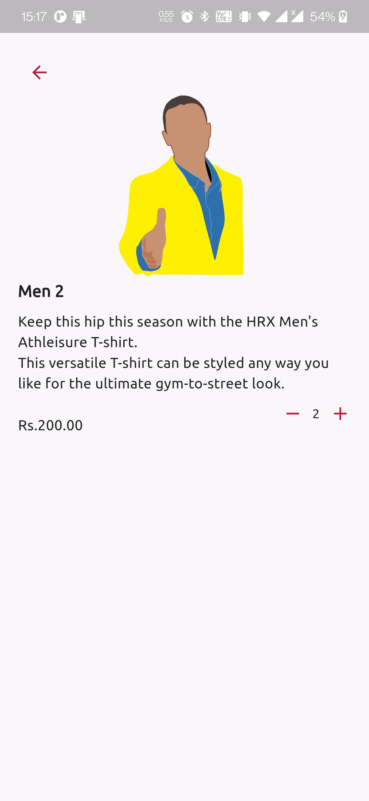
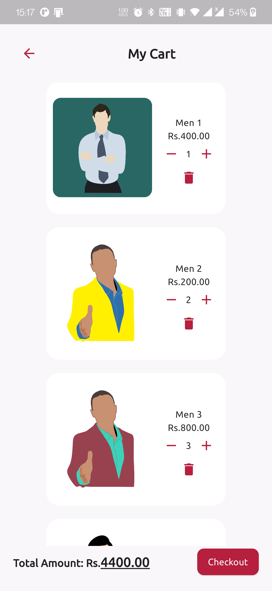
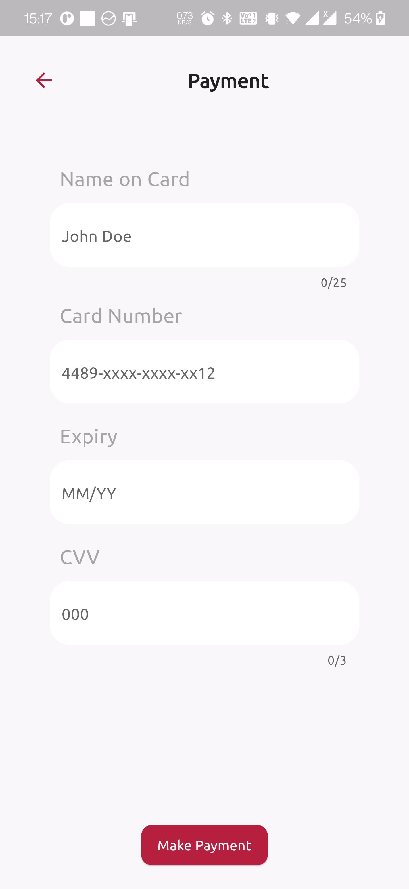

# 👖👕 Simple Shopping - Shopping made Simple and Easier

A Flutter UI template of a Simple Shopping App Design I found on Uplabs.

Design screens are on [Uplabs.](https://www.uplabs.com/posts/shopping-app-uikit) It's free but for personal use, purchase it if you want to use it commercially.

> **Disclaimer:** I am not in anyway in affiliate with the designer of the screens. I just love the UI and decided to code it in Flutter😽

Don't forget to star⭐ the repo if you like what you see😉.
# 🎥 Demo
| Product Demo |
|------|
||

# 📸 Screenshots
The screenshots below are taken on a android emulator.

| 1 | 2|
|------|-------|
|||

| 3 | 4|
|------|-------|
|||

# ✨ Requirements
- Any Operating System (ie. MacOS X, Linux, Windows)
- Any IDE with Flutter SDK installed (ie. IntelliJ, Android Studio, VSCode etc)
- A little knowledge of Dart and Flutter
- Device to test (Physical or Emulator or you can test on web too🤯)

# 📲 Device Requirements
- Android 19 and above for Android APK
- iOS 9 or above for iPhone
- Chrome 86 or Above for Chrome Browser
- Windows 10 or Above or Windows Desktop App